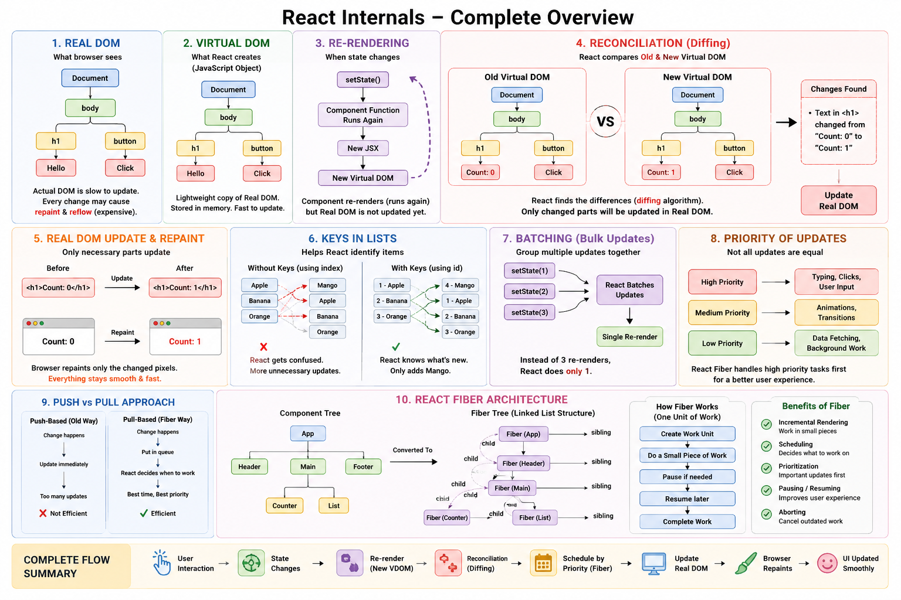

---



# 1. What is the Real DOM?

The **DOM (Document Object Model)** is the browser's representation of your webpage.

Example:

```html
<body>
  <h1>Hello</h1>
  <button>Click</button>
</body>
```

Browser creates a tree:

```text
Document
│
└── body
     │
     ├── h1
     │    └── Hello
     │
     └── button
          └── Click
```

This actual browser tree is called the **Real DOM**.

---

# Problem with Real DOM

Suppose:

```html
<h1>Counter: 0</h1>
```

becomes:

```html
<h1>Counter: 1</h1>
```

Browser must:

1. Find element
2. Update node
3. Recalculate layout
4. Repaint screen

Doing this repeatedly becomes expensive.

---

# 2. What is Repainting?

Repainting means:

> Browser redraws parts of the screen after changes.

Example:

```js
element.style.color = "red";
```

Browser must redraw that element.

---

# 3. What is Re-rendering?

In React:

```jsx
setCounter(counter + 1);
```

causes:

```text
Component Function Runs Again
        ↓
New JSX Produced
        ↓
React Compares Changes
```

This process is called:

# Re-rendering

Important:

React re-renders the component,

NOT necessarily the entire browser page.

---

# 4. What is the Virtual DOM?

React creates a lightweight copy of the Real DOM.

Example:

```text
Real DOM
│
├── h1
└── button
```

React keeps:

```text
Virtual DOM
│
├── h1
└── button
```

in JavaScript memory.

This is called:

# Virtual DOM

It is just a JavaScript object representation of the UI.

---

# Why Virtual DOM?

Without it:

```text
User Clicks
     ↓
Update Real DOM Immediately
     ↓
Expensive
```

With Virtual DOM:

```text
User Clicks
     ↓
Update Virtual DOM
     ↓
Compare Changes
     ↓
Update Only Necessary Parts
```

Much faster.

---

# 5. What is Reconciliation?

Reconciliation is React's process of:

```text
Old Virtual DOM
        VS
New Virtual DOM
```

React compares them.

Example:

Old:

```html
<h1>Counter: 0</h1>
```

New:

```html
<h1>Counter: 1</h1>
```

React notices:

```text
Only text changed
```

and updates only that part.

This comparison process is called:

# Reconciliation

---

# Virtual DOM + Reconciliation

Together:

```text
State Changes
      ↓
Create New Virtual DOM
      ↓
Compare With Old Virtual DOM
      ↓
Find Differences
      ↓
Update Real DOM
```

---

# 6. What is Diffing?

React's comparison algorithm.

```text
Old Tree
    VS
New Tree
```

React finds differences.

This process is called:

# Diffing

Diffing is part of Reconciliation.

---

# 7. Why Do We Need Keys?

Consider:

```jsx
[
  "Apple",
  "Banana",
  "Orange"
]
```

React renders:

```jsx
<li>Apple</li>
<li>Banana</li>
<li>Orange</li>
```

Now insert:

```jsx
"Mango"
```

at beginning.

Without keys React thinks:

```text
Apple → Mango
Banana → Apple
Orange → Banana
```

Lots of unnecessary updates.

---

# With Keys

```jsx
<li key="1">Apple</li>
<li key="2">Banana</li>
<li key="3">Orange</li>
```

React knows:

```text
Apple still exists
Banana still exists
Orange still exists
```

Only:

```text
Add Mango
```

Much faster.

---

# Why Keys Are Important?

Keys help React:

* Identify elements uniquely
* Reduce unnecessary updates
* Improve performance
* Preserve component state

---

# Bad Key

```jsx
key={index}
```

Sometimes works, but causes problems when items are reordered.

---

# Better

```jsx
key={user.id}
```

Unique IDs are preferred.

---

# 8. What is Iteration?

Iteration means:

> Repeating over a collection of items.

Example:

```js
const fruits = ["Apple", "Banana", "Orange"];
```

Loop:

```js
fruits.map(...)
```

React commonly uses:

```jsx
fruits.map((fruit) => (
  <li>{fruit}</li>
))
```

This is iteration.

---

# 9. Immediate Updates vs Bulk Updates

Suppose:

```jsx
setCounter(1);
setCounter(2);
setCounter(3);
```

Should React update screen 3 times?

No.

React batches updates.

```text
Collect Updates
      ↓
Process Together
      ↓
One Render
```

This improves performance.

---

# Why Batch Updates?

Without batching:

```text
Render #1
Render #2
Render #3
```

Wasteful.

With batching:

```text
Single Render
```

Efficient.

---

# 10. Priority of Updates

Not all updates are equally important.

Example:

User typing:

```text
A
B
C
```

must feel instant.

But:

```text
Loading large list
```

can wait slightly.

React assigns priorities.

```text
High Priority
   ↓
User Input

Medium Priority
   ↓
Animations

Low Priority
   ↓
Background Updates
```

---

# 11. Push-Based vs Pull-Based Approach

## Push-Based

System immediately pushes updates.

```text
Change Occurs
      ↓
Update Right Now
```

Problem:

Too many updates.

---

## Pull-Based

System decides when to process updates.

```text
Change Occurs
      ↓
Queue It
      ↓
Process At Best Time
```

React Fiber uses a pull-based model.

This gives React more control.

---

# 12. What is React Fiber?

Fiber is React's modern reconciliation engine.

Introduced in:

```text
React 16
```

Before React 16:

```text
Reconciliation
     ↓
Must Finish Completely
```

Cannot pause.

Large updates could freeze UI.

---

# Problem Before Fiber

```text
Update Huge Tree
      ↓
Browser Freezes
      ↓
User Can't Interact
```

Bad user experience.

---

# React Fiber Solution

Fiber breaks work into small pieces.

```text
Large Task
    ↓

Small Piece
Small Piece
Small Piece
Small Piece
```

React can:

* Pause work
* Resume work
* Cancel work
* Prioritize work

---

# Fiber Architecture

Think:

```text
React Component Tree
```

becomes

```text
Fiber Tree
```

Every component gets a Fiber Node.

```text
App
│
├── Header
├── Counter
└── Footer
```

becomes

```text
Fiber Nodes
│
├── Header Fiber
├── Counter Fiber
└── Footer Fiber
```

---

# Functionality of Fiber

Fiber enables:

### 1. Incremental Rendering

```text
Work Little By Little
```

---

### 2. Scheduling

```text
Choose Important Tasks First
```

---

### 3. Prioritization

```text
Typing > Background Rendering
```

---

### 4. Pausing

```text
Stop Work
```

---

### 5. Resuming

```text
Continue Later
```

---

### 6. Aborting

```text
Throw Away Old Work
```

if newer updates arrive.

---

# Complete Flow

```text
User Clicks Button
        ↓
State Changes
        ↓
New Virtual DOM Created
        ↓
Fiber Starts Reconciliation
        ↓
Diffing
        ↓
Find Changes
        ↓
Schedule Work By Priority
        ↓
Update Real DOM
        ↓
Browser Repaints
```

## One-Line Summary

**Virtual DOM** = JavaScript copy of UI.

**Reconciliation** = Comparing old and new Virtual DOM.

**Diffing** = Finding differences.

**Keys** = Help React identify list items efficiently.

**Re-rendering** = Component runs again after state changes.

**Fiber** = React's modern engine that performs reconciliation efficiently using scheduling, prioritization, pausing, and batching of updates.
